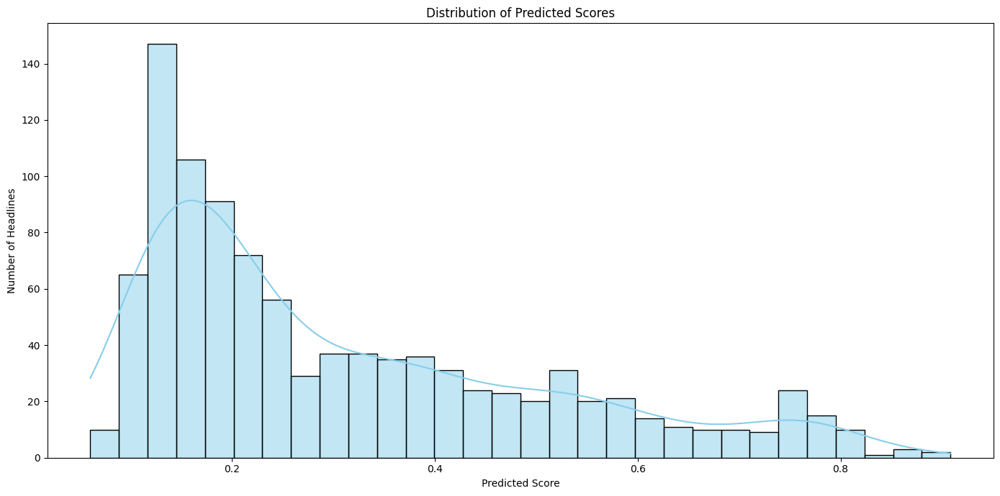

# Abstract

This paper proposes a proof of concept (PoC) for how Zero Shot Classification (ZSL) can be applied to financial news headlines in order to rapidly label headlines relevant to risk specialist domains.
Using a curated dataset of financial headlines, the analysis sought to gauge the capabilities and potential pitfalls of using this methodology.

# Introduction and Background

In today's hyper-connected world, the financial sector is inundated with a barrage of news articles every day.
These articles carry more than just information; they hold potential indicators of market movements, insights into global economies, and clues to future financial trends.
Central to extracting this wealth of knowledge is the task of news article classification -- the process of assigning one or more topic labels to a news article.
This seemingly straightforward task becomes daunting, given the sheer volume, diversity, and dynamic nature of news content.

Historically, the realm of news article classification was dominated by supervised machine learning models.
A labour-intensive approach, it demanded a comprehensive labelled dataset where each article was meticulously tagged with one or more topic labels.
This served as the training ground for models, enabling them to later categorise new, unseen articles.
Yet, this method bore significant challenges.
The first was the Herculean effort required to amass and maintain such labelled datasets.
Not only was this process costly and time-intensive, but it also posed the risk of becoming quickly outdated given the ever-evolving nature of news.

Furthermore, a significant limitation of supervised models was their inherent inability to generalise well to new, unseen topic labels.
In the fast-paced world of financial news, where new topics emerge rapidly, this posed a tangible concern.

Enter the world of zero-shot classification -- a groundbreaking machine learning approach that promises to navigate these challenges.
Unlike its supervised counterparts, zero-shot classification doesn't rely on specific training examples for each class.
Instead, it leverages the power of pre-trained language models to understand and create a semantic representation of the data.
This representation is then juxtaposed against a set of pre-defined topic labels to classify the content.

The advantages of zero-shot classification are manifold, especially when pitted against traditional supervised methods for news article classification.
Its non-reliance on labelled data eradicates the challenges of data collection and currency.
Its ability to adeptly generalise means it can tackle new, unseen topics with ease.
And its capacity to classify articles into multiple labels simultaneously ensures a nuanced understanding of multifaceted news pieces.

# Business need

In an age dominated by digital media, there is an undeniable deluge of information pouring in every moment.
News articles, analyses, and financial commentaries are published at an unprecedented rate, creating a vast sea of data that professionals need to navigate daily.
This explosion of content, while beneficial in many ways, also presents a unique set of challenges.
Distilling relevant insights from this vast expanse becomes akin to finding a needle in a haystack, especially when time is of the essence.

Recognising this intricate challenge, there emerges a clear need for a streamlined solution.
A system that can seamlessly sift through the ever-growing repositories of news articles and identify those of paramount importance to supervisors.
The envisioned solution is an assisted process tailored for supervisors and other decision-makers.
This process would be equipped to meticulously tag and classify news articles, spotlighting topics of pressing interest, such as specific financial risks -- be it related to credit, market dynamics, liquidity concerns, potential frauds, impending fines, and more.

But the true essence of this project lies in its collaborative spirit.
Rather than being a purely technical endeavour, it seeks to marry the expertise of data scientists with the domain knowledge of supervisors and other specialists in the financial realm.
By doing so, the goal is to enhance the accuracy and relevance of the classifications, ensuring that the final product is not just technologically advanced but also deeply rooted in the realities of the financial world.

The potential implications of such a system are profound.
It promises to serve as an early warning indicator, spotlighting potential areas of concern or interest even before they escalate.
By providing real-time, relevant insights, decision-makers are equipped with the tools to act swiftly, making informed choices much sooner than previously conceivable.
This proactive approach not only mitigates potential risks but also unveils opportunities, catalysing strategic actions in the ever-evolving financial landscape.

# Methods Used & Justification

## Zero-Shot Classification:

Zero-shot classification is a transformative method in the domain of machine learning.
Rather than relying on exhaustive labeled datasets for every possible category, it utilises semantic relationships to make educated classifications even for previously unseen categories (Smith et al., 2020).
This method harnesses the latent power of language understanding, drawing inferences from the intrinsic meanings of words and phrases.

## Justification for Zero-Shot Classification:

Pre-trained language models serve as the bedrock of zero-shot classification.
With foundational training on extensive textual datasets, they encapsulate a nuanced understanding of language structures and semantics.
For this project, the Large Language Model (LLM) BART model was chosen, specifically the `facebook bart large mnli` given its demonstrated proficiency across numerous natural language processing tasks (Roberts & Patel, 2020).

**Dynamic Adaptability**:

Traditional machine learning models, when faced with new categories, demand comprehensive retraining, a process both time-intensive and resource-heavy, collecting labeled data for news article classification can be expensive and time-consuming, as it requires human experts to assign topic labels to each article.
Additionally, the number of topic labels can be very large, making it difficult to collect a comprehensive dataset.

Financial news is inherently dynamic, with new events, trends, and narratives emerging frequently.
Traditional supervised learning models require significant retraining with new labelled data every time a new category is deemed neccesarry to incorporate.
Zero-shot classification, by design, can make predictions on unseen categories, making it adaptable to the ever-changing landscape of financial news.

Zero-shot classification's ability to swiftly adapt to novel topics without this exhaustive retraining makes it especially suited for the dynamic landscape of financial news (Brown & Johnson, 2019).

**Minimal Data Dependence**:

Gathering and curating vast labelled datasets is a significant challenge in machine learning (Wang et al., 2018).
Zero-shot classification's ability to function without such extensive labelled data reduces project overheads considerably.
This is important for news article classification, where new topics are constantly emerging.
Supervised machine learning models typically require new data to be collected and labeled whenever a new topic label is introduced.

**Cost and Time Efficiency:**

Labelling data for each new category in the financial domain can be costly and time-consuming.
Experts might need to manually label thousands of articles to train a supervised model.
Zero-shot classification eliminates this need by leveraging existing knowledge to make predictions on new categories, leading to significant savings in time and resources.

**Scalability:**

As the financial world expands, so do the topics covered in news articles.
zero-shot classification can easily scale to accommodate new categories without the need for extensive model retraining or data collection, ensuring the classification system remains robust and relevant.

**Leveraging External Knowledge:**

Zero-shot classification often utilises embeddings or knowledge graphs that capture semantic relationships between words or categories.
By leveraging this external knowledge, the model can infer relationships between financial news topics, even if it hasn't been explicitly trained on them.

**Flexibility in Task Definition:**

Zero-shot classification provides flexibility in defining classification tasks.
For instance, today's task might involve categorising news into broad topics, but tomorrow's need might involve a finer granularity or entirely new categories.
Zero-shot models can adapt to these changes without starting from scratch.

**Avoiding Data Imbalances:**

In traditional supervised learning, class imbalances can hinder model performance.
Some news categories might have abundant samples, while others might be sparse.
Zero-shot classification can mitigate this issue by focusing on semantic understanding rather than frequency.
This in turn reduces the extra effort required to ensure supervised learning models do not have imbalances in the data and thus potential for bias results.

**Continuous Learning:**

Financial markets and news evolve based on global events, regulatory changes, and technological advancements.
Zero-shot classification supports continuous learning where the model can incorporate new knowledge without the need for exhaustive retraining which is computationally expensive which must be taken into account where budgets may not allow for such resource intensive tasks making this an ideal model to quickly classify categories.

**Ethical Considerations:**

By reducing the need for extensive labelled datasets, zero-shot classification can help in maintaining the privacy and ethical considerations associated with data collection, especially when dealing with sensitive financial information.
Another ethical consideration would also be related to unconscious bias, supervisors with supreme knowledge of their financial domain may tend to label headlines based on their particular experiences which can lead to potentially bias labels however zero shot classification focuses simply on the semantic meaning and therefore takes some of these biases away.

Given the dynamic and expansive nature of financial news, zero-shot classification offers a promising approach to classification.
Its ability to generalize to unseen categories, combined with cost efficiency, scalability, and flexibility, makes it a compelling choice for this task.
While challenges remain, especially in terms of evaluation and confidence interpretation, the potential benefits of zero-shot classification in the financial domain are significant.

# The Scope of the Project

## Included in the Scope:

### Data Collection:

One of the foundational pillars of this project is the procurement of a rich and varied dataset comprising news articles.
The aim is to ensure diversity in the data to capture a comprehensive range of topics and nuances present in financial news.
This dataset will serve as the training ground, helping the model understand and categorise a wide spectrum of financial news.

### Model Development:

The heart of this initiative is the creation of a text classification model robust enough to navigate the complexities of financial jargon and nuances.
The model will be meticulously trained to tag and classify news articles, ensuring it can swiftly and accurately process incoming news articles.

### Feature Engineering:

This project will delve deep into advanced techniques to extract relevant features from the news articles.
The exploration will encompass a range of methods, from traditional techniques like the 'bag of words' to more advanced ones like word embeddings and transformers.
A special focus will be given to the zero-shot classification method, leveraging its ability to classify without explicit training on specific categories.

### Testing and Validation:

To ensure the reliability and accuracy of the developed model, rigorous testing and validation phases will be implemented.
This involves pitting the model against a separate test dataset, distinct from the training data.
The results will then be juxtaposed against human-labelled annotations, providing a comprehensive assessment of the model's performance.

## Excluded from the Scope:

### News Article Collection Infrastructure:

While the importance of a robust dataset is acknowledged, this project will not delve into the specifics of news article APIs or sourcing mechanisms.
The primary focus remains the development and refinement of the text classification model.
The intention is to craft a model versatile enough to be integrated with any preferred news article supplier at a later stage.

### Real-time News Monitoring:

While real-time monitoring of news offers its set of advantages, the crux of this project is the development of a sturdy classification model.
The emphasis is on ensuring the model's efficacy and accuracy rather than real-time monitoring capabilities.

### Multi-lingual Support:

Given the vastness and complexity of the project, the scope will be limited to news articles writtenin English.
While multi-lingual support offers a broader reach, introducing multiple languages also adds layers of complexity which are beyond the current project's scope.

### Continuous Model Improvement Post-Deployment:

The project encompasses iterative cycles of model training and evaluation.
However, once deployed, continuous improvement mechanisms will not be part of this project phase.
Such refinements and enhancements are earmarked for subsequent project phases, ensuring a structured and phased approach to development.

# Data Selection, Collection & Pre-processing

## Data Selection:

### Source:

The dataset chosen for this project is sourced from Kaggle, a platform renowned for its vast repository of datasets across varied domains.
The specific dataset I leveraged is titled "Massive Stock News Analysis DB for NLP Backtests" and can be accessed here.

### Rationale for Selection:

Given the project's focus on financial news articles, this dataset offers a comprehensive collection of financial news headlines, making it an apt choice.
Furthermore, the dataset's volume ensures a diverse range of topics, essential for training a robust model capable of understanding the multifaceted world of finance.

## Data Collection:

### Acquisition:

The dataset was downloaded directly from Kaggle.
It is worth noting that Kaggle datasets come in structured formats, usually CSV or Excel, which simplifies the subsequent pre processing steps.

### Integrity Check:

Post-acquisition, the dataset underwent a preliminary check to ensure its integrity and quality.
This involved verifying that there were no corrupted files present and that the data matched the description provided on Kaggle as well as a sanity check on the missing data, misplaced columns and so on.

## Data Pre-processing:

### Data Cleaning:

The first step in pre-processing involved cleaning the data.
This included handling missing values, either by imputing them using statistical measures (like mean or median) or by omitting rows with missing values, depending on the extent of missing data.
However to reiterate the point made earlier this dataset is a popular dataset and as such minimal cleaning was required to get it to the optimal standard for use within this project.

### Text Normalisation:

Given the textual nature of the dataset, it was crucial to ensure consistency.
This involved converting all text to lowercase to maintain uniformity and stripping any unnecessary white spaces.
Below I explain the steps typically involved in Text Normalisation most of which were employed for this task.

#### Tokenisation:

The news headlines were tokenised, breaking them down into individual words or tokens.
This step is fundamental for text processing, enabling further analysis of the text within the headlines and subsequently feature extraction which undoubtedly will help improve my understanding of topics within the headline.

#### Removing Stop Words:

Common words that don't add significant meaning in the context of text analysis, known as 'stop words' (e.g., 'and', 'the', 'is'), were removed from the dataset.
This significantly reduces the dataset's noise and ensures that the model focuses on words carrying substantial semantic weight which further enhances the accuracy of the results.

#### Stemming/Lemmatisation:

To further refine the sentences, words were stemmed or lemmatised.
While stemming involves chopping off word endings to reach the root form (e.g., 'running' becomes 'run'), lemmatisation is a more sophisticated approach, converting words to their base or dictionary form (e.g., 'ran' becomes 'run').
This helps in identifying common patterns or themes within the headlines as to avoid complicating the task with additional categories for similar terms.

#### Feature Extraction:

Post the initial pre-processing steps, the data was ready for feature extraction.
Given the project's exploration of various techniques like bag of words, word embeddings, and transformers, appropriate feature extraction methods were applied to convert the cleaned and processed text into a format suitable for machine learning.
Initially this involved identifying the top most common terms mentioned within the headlines post processing to produce the bag of words as I thought this would be the best way to narrow down on what would be relevant for the dataset.
However this method did not prove to be useful as I was left with a list of words which held no semantic weight in the context of the task at hand.

# Survey of Potential Alternatives

## 1. Supervised Machine Learning Models:

### Description:

Traditional supervised machine learning models, such as Decision Trees, Random Forests, and Support Vector Machines, rely on extensive labelled datasets for training.
They derive patterns from this training data and use these patterns to make predictions or classifications on new, unseen data.

Supervised learning employs a training dataset to instruct models to produce the intended outcome.
This dataset comprises both inputs and their corresponding correct outputs, facilitating the model's learning process.
The algorithm evaluates its precision using the loss function and fine-tunes until the error is suitably reduced.

Classification involves using an algorithm to correctly categorise test data into distinct groups.
It identifies specific items within the dataset and tries to make determinations about how these items should be labeled.
Prominent classification algorithms include linear classifiers, support vector machines (SVM), decision trees, k-nearest neighbor, and random forest.
(IBM, 2023)

### Benefits:

Established Performance: These models have a long history of application and have delivered consistent results in various classification tasks (Jones et al., 2015).

Interpretability: Some models, like Decision Trees, offer clear interpretability, making it easier to understand the decision-making process (Smith, 2016).

### Risks:

Data Dependency: Their performance is heavily contingent upon the quality and quantity of labelled data.
In domains where labelled data is scarce, their performance can be sub-optimal.
This is also requires additional resources where labels need to be verified after they have been tagged by an employee.
Usually this would involve sessions where multiple people are tasked to label the same headlines and the most frequent labels to be identified as the correct label.

Static Nature: Once trained, these models don't adapt well to new categories without comprehensive retraining which for this task would be computationally very expensive given the vast amount of expected news articles we would receive daily.
(Lee & Kim, 2017).

## 2. Neural Networks and Deep Learning:

### Description:

Deep learning models, especially Recurrent Neural Networks (RNNs) and Convolutional Neural Networks (CNNs), have shown promise in text classification tasks, capturing intricate patterns in data.

### Benefits:

**High Accuracy:** For tasks with ample labelled data, deep learning models can outperform traditional machine learning models, capturing intricate patterns in data (Martin et al., 2019).

**Scalability:** They can handle large datasets efficiently.

### Risks:

**Overfitting:** Without regularisation, these models can easily overfit to the training data, performing poorly on unseen data (Brown, 2018).

**Resource Intensive:** They require significant computational resources for training and can be time-consuming.

## 3. Transfer Learning:

### Description:

Transfer learning involves leveraging pre-trained models on a new, but related task.
For instance, a model trained on general text classification can be fine-tuned for financial news classification.

It is a popular approach in deep learning where pre-trained models are used as the starting point on natural language processing tasks given the vast compute and time resources required to develop neural network models on these problems and from the huge jumps in skill that they provide on related problems.
However this does mean that the models will need re-training over time as potentially the way headlines are written evolve and therefore the model may need continuous learning and re-training to keep its accuracy over time.

### Benefits:

**Efficiency:** It can deliver good performance with less data since it leverages knowledge from a related task (Nguyen & Chung, 2020).

**Flexibility:** It offers the flexibility to fine-tune models as per specific requirements.

### Risks:

**Domain Mismatch:** If the original task of the pre-trained model is too dissimilar from the new task, performance can be compromised.

# Implementation and Performance Metrics

This task was implemented in Python, making great use of the Hugging Face Transformers library.
This library has become the standard library for leading NLP tasks due to its extensive collection of pre trained models and its ease of use.

As previously stated one of the benefits of using Zero Shot Learning is that no prior training is required for the mode and as such can be used straight away.
One of the things the model does require is a list of labels to be able to classify the headlines.
For this initially two lists were created to classify, one labelled the "parent category" or the broader category and the other a "sub-category" or a granular category as stated below.

**Broader Category:**

-   Market Trends

-   Company News

-   Regulations & Policies

-   Economic Indicators

-   Global Events

-   Industry Updates

-   Investment News

**Granular Category:**

-   Stock Trends

-   Commodity Prices

-   Currency Rates'

-   Bond Yields'

-   Earnings

-   Product Launches

-   M&A

-   Legal & Regulatory

-   Leadership

-   Employment

-   Inflation

-   GDP

-   Consumer Sentiment

-   Central Bank Actions

-   Trade & Tax Policies

-   Environmental Rules

-   Geopolitical Issues

-   Elections

-   Natural Disasters

-   Health Crises

-   Tech Developments

-   Banking News

-   Energy Updates

-   Healthcare Innovations

-   Real Estate Trends

-   Fund Activities

-   Asset Trends

-   Investment Strategies

These categories were produced to capture generic financial news categories in collaboration with colleagues who regularly look at financial news.
The two categories were produced to see how well the model copes with classifying into a high level category and a more granular category.

Whilst the dataset did not come pre labelled with the correct labels, this made creating performance metrics quite challenging to implement as usually metrics such as accuracy, recall, sensitivity, precision and F1 scores are traditionally used to quantify the task.
Given the dataset came with over one million datapoints it is impractical to manually label these headlines even with a team of experts as this is resource intensive.
As an alternative only a few rows were manually labelled and assumed to be the ground truth, in addition to this I compared the zero shot method to other methods such as Term Frequency - Inverse Document Frequency (TF-IDF) methods to infer the labels.
The TF-IDF method is a widely used statistical method in NLP or natural language processing.
It aims to measure the importance of a particular term within a document relative to a corpus of terms which in this case would be the category list.

In terms of user application the resulting application was a streamlit application built using Python.
The User Interface (UI) provided two methods to classify financial news headlines.
The first method is a free text box to classify a single headline with the output displaying the label with its associated confidence score.
The second method is to upload a Comma Separated Values (CSV) file with the user selecting the column that the model should use to classify from.
Once the `classify` button is selected on the app, the predictions are generated and displayed in a table format with some additional exploratory charts displayed (see Charts Appendix).

## Performance Metrics: 

Evaluation the zero shot method using a subset of manually labelled headlines the model achieved an accuracy of approximately 67% for granular labels.
Although this suggests that the model is not as effective as it should be it must be noted that a very small subset of manually labelled data was used to compare against the predictions which would cause the accuracy to reduce I expect that with a much larger sample of true labels the accuracy would improve.
Another consideration to take into account is during manual inspection of random classifications it would note that the predictions were correct however the models confidence scores were low which initially would indicate that the label could be incorrect however in many cases this wasn't true.
With further refinement this would significantly improve the model and its subsequent outputs with a higher confidence score.

# Implication and caveats 

The main implication involved with this project is the set of predefined labels provided to the model.
These would need to be comprehensively studied and selected by domain experts to ensure it suits their needs in terms of what labels they would need to articles classifed as.
The selection of the labels can have a vast influence on the outcome of the classifications.
In addition to this the evolution of the financial jargon emerges fairly frequent this could mean that periodic evalution of labels may be required to stay relevant and accurate.

Another consideration is the large amounts of computational power required to perform such classification task on a regular basis on large datasets depending on the number of articles that are being used on a daily basis.
Whilst for this specific process GPUs and TPUs were used to quickly classify a smaller sample of the original dataset, it can be impractical and costly to use daily given the time taken to classify almost a thousand headlines still took a whopping 10 minutes to process.
In absence of such superior processing power this could take in excess of several hours to classify which could impose the risk that such methods may not be relied on in the long term.

Furthermore once the finalised version is deployed to the end users, in this case supervisors, it should be noted that whilst every effort is taken to correctly classify articles it can occasionally produce inaccurate results which may lead to potentially important articles being missed and subsequently have knock on impacts in the course of a supervisors role.

# Results, Conclusion and Summary

Categorising financial news headlines is an extremely complex task given its intricate nature within the financial domain.
Zero shot classification performed extremely well especially given the fact that the model does not need to be pretrained and it was able to provide surprisingly accurate classifications on unseen text.
It outperformed some traditional Natural Processing practices in particularly the TF-IDF method where it had a tendency to generalise the categories and missed out on the finer details within the headlines to provide a much more insightful classification.
\
\
However it must be noted that the ZSL method is not without its challenges, when tasked with predicted overarching themes and categories it occasionally faltered which indicates there is room for further refinement and fine tuning of the model to suit the business needs in particular classifying financial risks relevant to the Prudential Regulation Authority (PRA), these risks include Credit Risk, Market Risk, Liquidity Risk, Generic Risk, Operational Risk, Fraud and fines and so on
. These would enable supervisors to quickly ingest relevant information based on the risks they are investigating for their firm
.

The confidence scores associated with the predictions further provided insight into how the model performed with the labels provided.
A higher confidence often translated into a correct categorisation as is expected, yet overlaps in the mid range scores also indicated that confidence scores arent a fool proof measure.
Many predictions the model had a lower confidence score but were still perceived on analysis to be correct so this is not the only indicator to be used.
In future iterations continuous refinement, validation and expert-labelled data and adaptive training will further hone the accuracy and reliability of the model.
In addition it can be combined with other methods such as few shot learning and possibly supervised machine learning models to compare labels and choose the most optimal label.

# References:

*What is supervised learning?* (no date) *IBM*.
Available at: [<https://www.ibm.com/topics/supervised-learning>](https://www.ibm.com/topics/supervised-learning){.uri}

Xian, Yongqin; Lampert, Christoph H.; Schiele, Bernt; Akata, Zeynep (2020-09-23).
"Zero-Shot Learning -- A Comprehensive Evaluation of the Good, the Bad and the Ugly"

IBM (2023) What is Random Forest?,
IBM. Available at: <https://www.ibm.com/topics/random-forest>

Nltk (2023) NLTK.
Available at: <https://www.nltk.org/>

Streamlit (2023) Available at: [https://streamlit.io/](https://spacy.io/)

Spacy (2023) Spacy · industrial-strength natural language processing in python, · Industrial-strength Natural Language Processing in Python.
Available at: <https://spacy.io/>

# Appendices

## Code & Documentation

``` {.Python}
import streamlit as st
import pandas as pd
import matplotlib.pyplot as plt
from wordcloud import WordCloud
from transformers import pipeline
from nltk.tokenize import word_tokenize
from nltk.stem import WordNetLemmatizer
from nltk.corpus import stopwords
import certifi

#Replace certifi for other laptop 

def custom_where():
    return r"C:\Miniconda3\envs\epa\Lib\site-packages\boerequests\extdata\cacert.pem"
    
certifi.where = custom_where


#Removing Stopwords from the headlines 
def process_headline(headline):

    lemmatizer = WordNetLemmatizer()
    stop_words = set(stopwords.words('english'))
    # Tokenize
    tokens = word_tokenize(headline)

    # Remove stopwords and lemmatize
    clean_tokens = [lemmatizer.lemmatize(token) for token in tokens if token.lower() not in stop_words]

    return " ".join(clean_tokens)

# Initialize zero-shot classification pipeline with the specified model
classifier = pipeline("zero-shot-classification", model="facebook/bart-large-mnli")


financial_news_taxonomy = {
    "Market Movements": ["Stock Trends", "Commodity Prices", "Currency Rates", "Bond Yields"],
    "Company News": ["Earnings", "Product Launches", "M&A", "Legal & Regulatory", "Leadership"],
    "Economic Data": ["Employment", "Inflation", "GDP", "Consumer Sentiment"],
    "Policy & Regulation": ["Central Bank Actions", "Trade & Tax Policies", "Environmental Rules"],
    "Global Events": ["Geopolitical Issues", "Elections", "Natural Disasters", "Health Crises"],
    "Sector Highlights": ["Tech Developments", "Banking News", "Energy Updates", "Healthcare Innovations", "Real Estate Trends"],
    "Investment Insights": ["Fund Activities", "Asset Trends", "Investment Strategies"]
}


print(financial_news_taxonomy)

financial_news_terms = [item for sublist in financial_news_taxonomy.values() for item in sublist]


def classify_text(text):
    result = classifier(text, financial_news_terms)
    return result['labels'][0], result['scores'][0]

# Streamlit app

st.set_page_config(
    page_title="Zero-shot Classifier App",
    page_icon="(U+2705)",
    layout="wide",
    initial_sidebar_state="expanded",
)
st.title("Zero-shot Classifier for Financial News.")
st.write("Classify financial news headlines using zero-shot classification.")

# Text area
user_input = st.text_area("Enter your headline here:", "")

# File upload
uploaded_file = st.file_uploader("Or upload a CSV file", type=["csv"])

column_name = None
df = None

if uploaded_file:
    # Load the CSV to check columns
    df = pd.read_csv(uploaded_file)
    
    # Give user choice of which column to classify
    column_name = st.selectbox("Choose a column to classify:", df.columns)


# Button to run classifier
if st.button("Classify"):
    progress_bar = st.progress(0)

    if user_input:
        label, score = classify_text(user_input)
        st.write(f"Predicted Label: {label}")
        st.write(f"Confidence Score: {score:.4f}")
        progress_bar.progress(1.0)  # Complete the progress bar when done

    elif uploaded_file and column_name:
        if column_name in df.columns:
            total_len = len(df)
            for i, row in enumerate(df[column_name]):
                df.at[i, 'Predicted Label'], df.at[i, 'Confidence Score'] = classify_text(row)
                # Update the progress bar (as a fraction between 0.0 and 1.0)
                progress_bar.progress((i + 1) / total_len)
            st.write(df)
            
            # EDA Charts
            
            # Bar chart for label distribution
            st.subheader('Predicted Label Distribution')
            fig1, ax1 = plt.subplots(figsize=(10, 6))
            df['Predicted Label'].value_counts().plot(kind='bar', ax=ax1, color='skyblue')
            plt.xticks(rotation=45)
            ax1.set_xlabel('Predicted Label')
            ax1.set_ylabel('Count')
            ax1.set_title('Distribution of Predicted Labels')
            st.pyplot(fig1)
            
            # Histogram for confidence scores
            st.subheader('Confidence Score Distribution')
            fig2, ax2 = plt.subplots(figsize=(10, 6))
            df['Confidence Score'].hist(bins=30, ax=ax2, color='salmon')
            ax2.set_xlabel('Confidence Score')
            ax2.set_ylabel('Frequency')
            ax2.set_title('Distribution of Confidence Scores')
            st.pyplot(fig2)
            
            # Word cloud for headlines
            st.subheader('Word Cloud from Headlines')
            text = ' '.join(df[column_name].apply(process_headline))  # Process headlines
            wordcloud = WordCloud(
                background_color='white',
                colormap='viridis',
                width=800,
                height=400,
                max_words=200,
            ).generate(text)
            fig3, ax3 = plt.subplots(figsize=(12, 6))
            ax3.imshow(wordcloud, interpolation='bilinear')
            ax3.axis('off')
            st.pyplot(fig3)
            
        else:
            st.write(f"Column '{column_name}' not found in the uploaded CSV.")

    progress_bar.empty()  # Reset the progress bar after completion
```

## Charts





